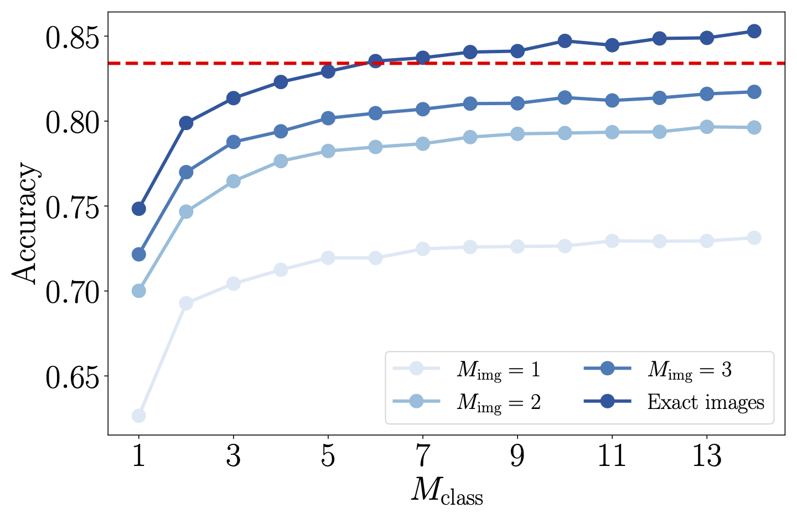

# Data compression for quantum machine learning
This is a compressed description of the paper [Data compresion for quantum machine learning](https://journals.aps.org/prresearch/abstract/10.1103/PhysRevResearch.4.043007). For more details, read the paper; if you have questions, get in touch!

## Overview
In the last few years, quantum computers have garnered widespread excitement across numerous disciplines, from [drug discovery](https://ieeexplore.ieee.org/abstract/document/8585034/) to [finance](https://www.sciencedirect.com/science/article/pii/S2405428318300571). The prospect of performing tasks too complex or large for classical computers prompted research across both academia and industry (see [Google](https://www.technologyreview.com/2019/10/23/102523/google-ceo-quantum-supremacy-interview-with-sundar-pichai/), [Microsoft](https://azure.microsoft.com/en-us/solutions/quantum-computing/), [IBM](https://quantum-computing.ibm.com/), [Amazon](https://aws.amazon.com/braket/)). This was spurred by [Google's landmark 2019 study](https://www.nature.com/articles/s41586-019-1666-5?categoryid=2849273&discountcode=DSI19S?categoryid=2849273) where a research team demonstrated that quantum computers could perform a particular task that regular "classical" supercomputers could not. In the coming years, the quantum computing community has two primary tasks -- first, to scale up quantum computing hardware, and second, to find useful algorithms that can be run on quantum computers. For the near future, however, quantum computers are noisy and hardware constrained (in the jargon, they are Noisy Intermediate Scale Quantum -- NISQ -- devices), so theoretical algorithms with large hardware requirements are impractical. 

There has also been parallel thought that because quantum systems easily produce patterns that classical systems can't efficiently replicate, quantum computers may be able to outperform classical computers on machine learning tasks. The field of [quantum machine learning](https://www.nature.com/articles/nature23474) is exciting, but is hampered by the lack of robust quantum hardware. This project introduces algorithms for image classification and data compression, specifically for NISQ devices. By creating and simulating algorithms on near-term hardware, we can benchmark quantum machine learning algorithms without access to full fledged quantum computers, which are years away. We also provide an open-sourced quantum dataset that uses our methods to encode images onto a format suitable for quantum computers, so future researchers have a common benchmark. 

## Method
Our approach uses [tensor networks](https://iopscience.iop.org/article/10.1088/1751-8121/aa6dc3/meta), which are factorizations of high-dimensional tensors. Tensor networks are useful because (1) they can be stored efficiently on classical computers, (2) they can efficiently approximate many quantum states, and (3) there is a  direct (albeit slightly complicated) way to encode a tensor network onto a quantum computer. We divide each image into patches, as in the following figure, then feed them into a tensor network. We encode each patch as a tensor network of its own.

Similarly, we introduce a second algorithm where each image is encoded as a quantum circuit (a collection of quantum gates, which are the essential processing unit in quantum computing, analogous to AND/OR gates in regular computing), then passed to a classifier quantum circuit.

## Results
We achieve competitive results for classifying images. In the following plots, $\chi$ is the bond dimension (the smaller the bond dimension, the more the actual quantum state is compressed). We also show different curves corresponding to the number of patches we split the image into -- more patches means less compression, at the cost of more complexity. 

Similarly, we achieve reasonable classification benchmarks on the quantum circuit. Here, $M$, is the number of layers in the circuit -- a larger $M$ means a more complex circuit. 

Finally, the actual prediction is well separated from the other possibilities, as shown in the following histogram.

This figure plots the predicted label -- one of ten possibilities -- against a quantity proportional to confidence of the classifier. The classifier is pretty confident in the correct label being the fifth one, even when we compress down to a small bond dimension (e.g., $\chi_{\text{img}} = 2$). This is really important, because if the prediction was just barely higher for the fifth label than the others, we would need a lot of measurements on the quantum computer to extract the predicted label. Instead, at least for these simple image classification tasks, we can make successful predictions even with a lot of compression (i.e., on very simple quantum circuits).

## Outlook
These are pretty simple classification tasks -- it makes sense to scale this to more complex datasets, and to explore whether there are tasks on which quantum computers can perform better than classical computers (convolutional neural networks are already really good at image classification). 

## Code
This code is written to run on an SGE computing cluster, but you should be able to adapt it to your needs. The function `main()` in `main_tn.py` contains most of the relevant functions. If you're having difficulties, feel free to get in touch.